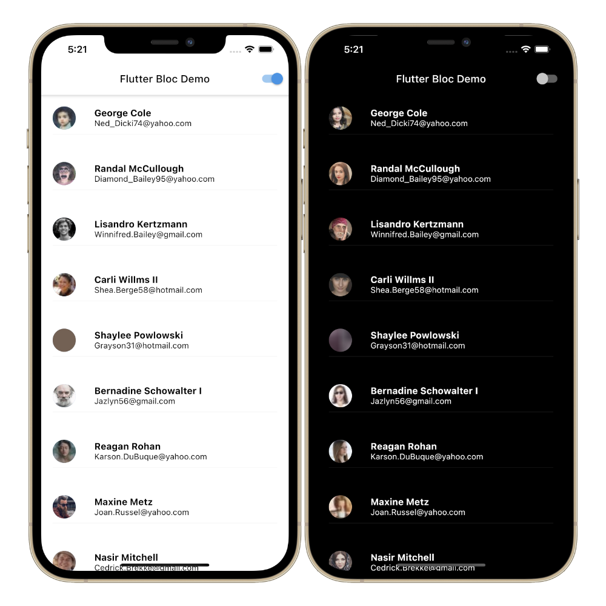

# Flutter Bloc Demo 

A test example of a Flutter application using the Bloc pattern.

It hits an API endpoint that returns mock user data proivided by a project set up in [mockApi](https://www.mockapi.io) 

The app supports switching between light and dark modes. 

